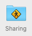
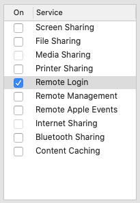
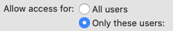

# Wrap podman up to make it work a little more like docker

## To install:

    pip install -e .

This will install a script called `docker`. You want to ensure that it's first on your path,
ahead of the `docker` executable.

## To use:

### Enabling sshd

First, you need to ensure you've got `sshd` enabled on your Mac:

- open the "System Preferences" panel
- select the "Sharing" group:
  
  
- activate "Remote Login":

  
- select "only these users":

  
- Hit the "+" button and add yourself.

### Installing and configuring podman

This uses the installation that is supplied by `brew`:

```shell
brew install podman
podman machine init --cpus 4 --disk-size 50 --memory 8192
podman machine start
```

### Setting up the sshfs reverse tunnel

Use the supplied script:

```shell
podman-mount-shim
```

This script will not exit; you can `^C` out of it when you're done. It sets up an ssh connection
to the podman machine, over which an `sshfs` connection is tunneled back to the Mac. Fair warning:
your entire home directory is then mounted using this into the podman VM.

### Tell the docker shim script to prefer to use podman

```shell
docker use podman
```

### Try it

```shell
docker run -ti --rm -v $HOME/src:/src oraclelinux:7-slim
```

The script intercepts `-v` flags and (crudely) rewrites them to point at the `sshfs`-mounted
directory.

... and that's it. Be warned: this is decidedly alpha quality.

## What you don't get

There's no docker-compose support (because I don't use it) - or anything else, for that matter.
Seriously; it's just a ten-minute drive-by.